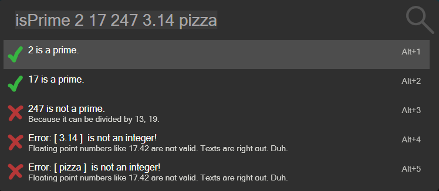

# IsPrime (Flow.Launcher.Plugin.IsPrime)

A [Flow Launcher](https://github.com/Flow-Launcher/Flow.Launcher) port of my original wox plugin [wox-plugin-isPrime](https://github.com/lvonkacsoh/wox-plugin-isPrime).

## About

Checks if the given integers are prime numbers.

The screenshot shows all relevant edge cases.
In case you are still unsure about what integers are consider consulting your favourite math tutor.

## Requirements

To use Python plugins within Flow you'll need Python 3.5 or later installed on your system.
You also may need to select your Python installation directory in the Flow Launcher settings.
As of v1.8, Flow Launcher should take care of the installation of Python for you if it is not on your system.

### Installing

The Plugin has been officially added to the supported list of plugins. 
Use `pm install isPrime` to install.

However you can also manually add it.

### Manual

Add the plugins folder to %APPDATA%\Roaming\FlowLauncher\Plugins\ and run the Flow command `restart Flow Launcher`.

### Python Package Requirements

This plugin depends on the python flowlauncher package.

> Without this package installed in your python environment the plugin wont work!

The easiest way to install it is to open a CLI like Powershell, navigate into the plugins folder and run the following command:

`pip install -r requirements.txt`

## Usage

| Keyword                                                          | Description                                 |
| ---------------------------------------------------------------- | ------------------------------------------- |
| `isPrime {number_0} {number_1} {number_N}` | check if the given values are prime numbers |

## Problems, errors and feature requests

Open an issue in this repo.

## About the port

I changed the plugins structure to be more like the [Currency Converter Plugin](https://github.com/deefrawley/Flow.Launcher.Plugin.Currency/tree/main) I used as a referrence.

For a quick how to port from Wox to Flow here a quick list of what I did:

- changed the import from Wox to  to `from flowlauncher import FlowLauncher`
- the class now inherits from `FlowLauncher` instead of `Wox`
- installed the flowlauncher python package
- that's literally all